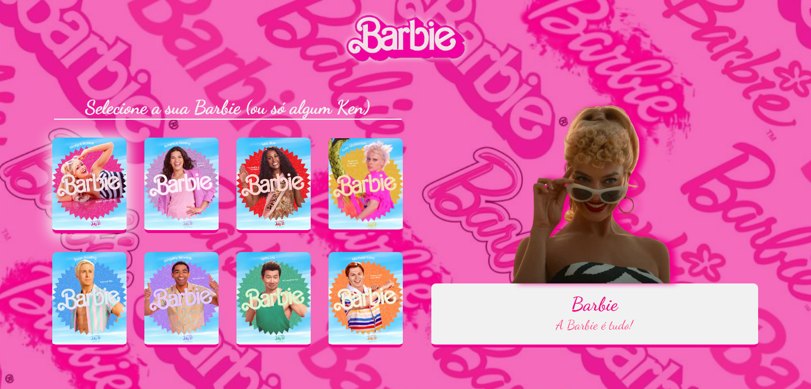

<h1 align="center"> Selecionar Barbie </h1>

Projeto desenvolvido durante a Semana do Zero do Programador Contratado, do <a href="https://github.com/devemdobro">Dev em Dobro</a>. O projeto original desenvolvido foi temático dos X-Men, mas optei por personalizar com o filme da Barbie.  

  <a href="#-tecnologias">Tecnologias</a>&nbsp;&nbsp;&nbsp;|&nbsp;&nbsp;&nbsp;
  <a href="#-deploy">Deploy</a>&nbsp;&nbsp;&nbsp;|&nbsp;&nbsp;&nbsp;
  <a href="#-english-version">English Version</a>&nbsp;&nbsp;&nbsp;&nbsp;&nbsp;&nbsp;

  

## 🚀 Tecnologias

Esse projeto foi desenvolvido com as seguintes tecnologias:

- HTML e CSS
- JavaScript
- Git e Github
- Figma

## 💻 Deploy

> [Clique aqui para navegar para o projeto!](x)

## 🌎 English Version

Barbie Selector is a project developed during <a href="https://github.com/devemdobro">Dev em Dobro</a>'s Semana do Zero ao Programador Contratado, where we develop a front-end project and learn more about the Web Development area with the twins. To do that, I've used:
- HTML, CSS, Javascript, Git, Github and Figma

> You can check out the deploy by [clicking here](x)!

---
### Desenvolvido por Sarah Schneider 🖖